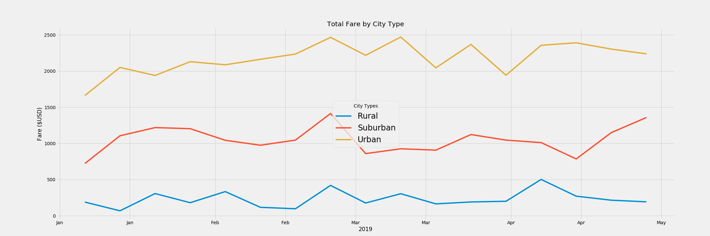
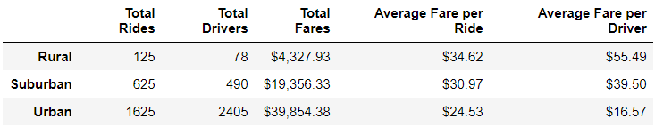

# PyBer_Analysis
Analyzing ride share data and creating visualizations using python, pandas and matplotlib

## Challenge Delivering Results

After finishing the presentation, I realized it would be good to gather some key metrics and plot fare data by city type on a weekly basis to discover business insights. Using the pandas and matplotlib libraries in conjunction I was able to combine the two datasets, preform analysis and create graphs to accomplish these goals.Some takeaways from the table and graph below is that total fares, average and weekly are great in Urban than Suburban city types and greater in Suburban than Rural city types. However, this is mostly due to the number of total rides as we can see from the summary table is that these relationship are actually reversed when it comes to the average fare per ride and the average fare per driver

The first challenge I encountered in this analysis was understanding the two data sets and then the merged data sets. To distingusih that one data set is city data with unique city values and one is ride data with repeated city values is important for the key metrics analysis. Using exploratory data analysis was the right step to correct this issue. Another challenge I encountered was setting the index to a datetime object in order to create time series data. Pandas documentation was useful in solving this. The last challenge I encountered was the manipulation of the plot. I was not able to eliminate the doubled x-axis value labels, even with the assitance of others.

Some recommendation and takeawsy from the data above are as follows. The ratio of rides to drivers decreases from Rural to Suburban to Urban city types. This is also true for the fare per driver and average far per ride. It is possible that increasing the number of drivers in rural and suburban city types and decreasing them in ubran city types could increase revenue and efficiency. Another analysis that could be done is on the length and time of rides. This could either support or negate the recommendation above based on whether rural and subruban drivers drive longer or not. We would do a similar type of analysis that we did with fares in this case, just using the length and time or rides as our variables. We could also looks at fare structure across the city types and see if we can use that to increase efficiencies by convicing drivers to drive in different city types. we could see how adjusting fares structures impacted  historical fares in python and we could also do a logical analysis in a group setting to break down incentives.
